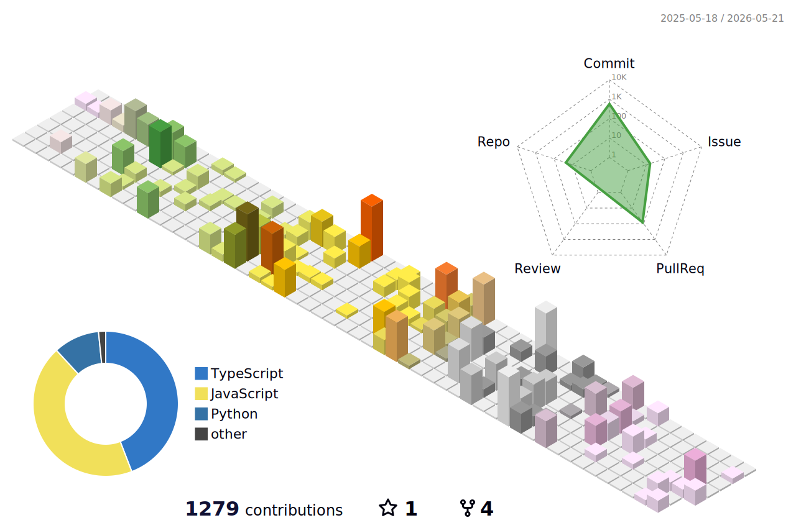

 

---

## About Me

- 🦉 Owl lover & Full-Stack Engineer at Kindai University (Faculty of Informatics)
- 💻 Web application development with a love for hardware & server tech
- ⌨️ Currently obsessed with custom keyboard design for better productivity
- 🌱 Exploring the intersection of software, hardware, and product thinking

---

## 🏆 Awards

| Date | Event | Award |
|------|-------|-------|
| Feb 2026 | Confidential Computing × LLM Ideathon | 🥇 Grand Prize |
| 2025 | JPHacks 2025 | 🏅 Innovation Award & Jury Prize |

---

## Tech Stack

**Languages**

**Frameworks & Tools**

---

## My GitHub Stats

  <picture>
    <source media="(prefers-color-scheme: dark)"  srcset="output/metrics.svg" width="420" />
    <source media="(prefers-color-scheme: light)" srcset="output/metrics.svg" width="420" />
    
  </picture>

  <picture>
    <source media="(prefers-color-scheme: dark)"  srcset="profile-3d-contrib/profile-night-rainbow.svg" width="100%" />
    <source media="(prefers-color-scheme: light)" srcset="profile-3d-contrib/profile-season-animate.svg" width="100%" />
    
  </picture>

---

